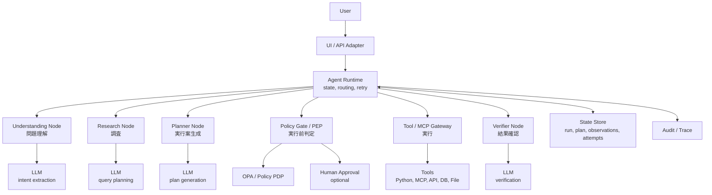
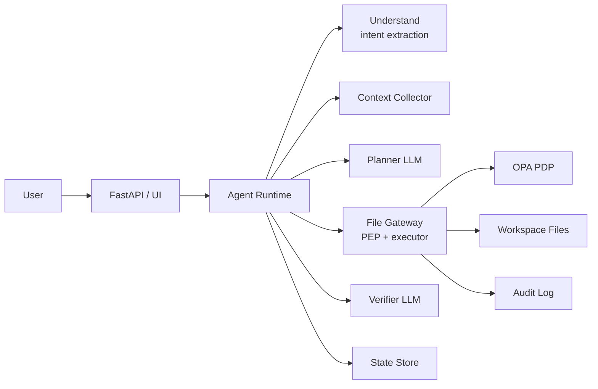
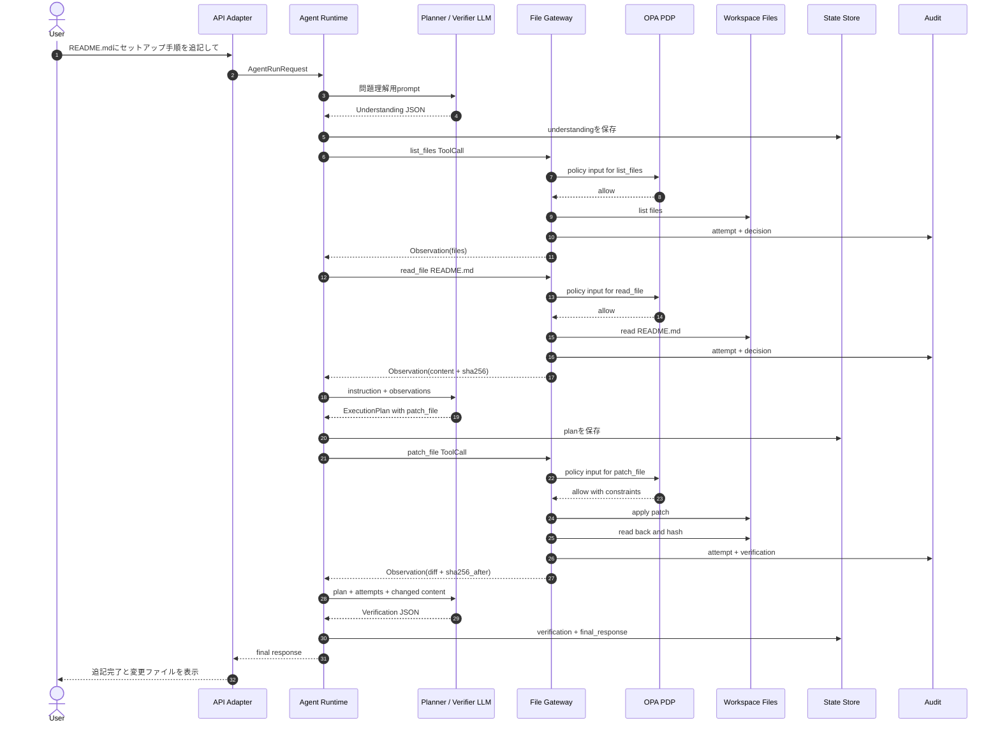
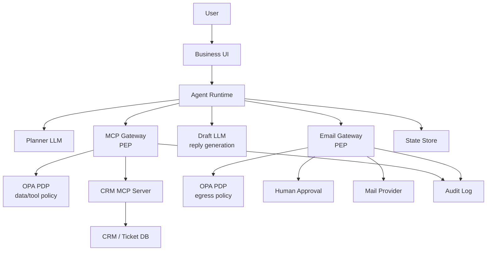
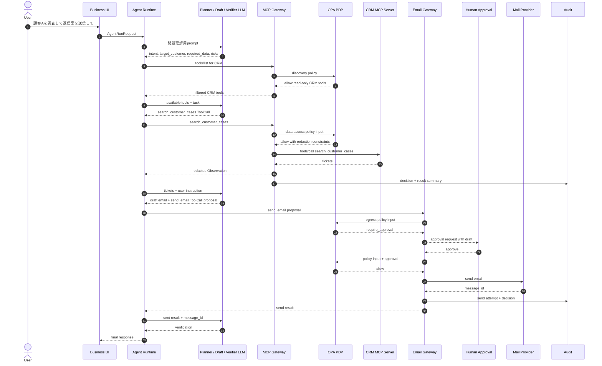
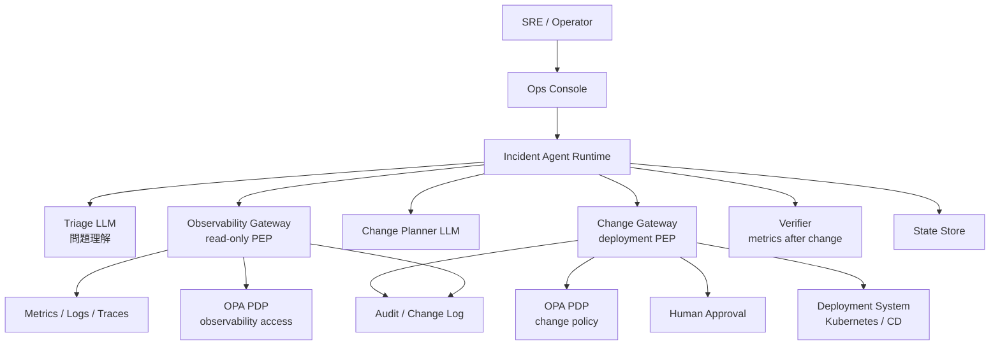
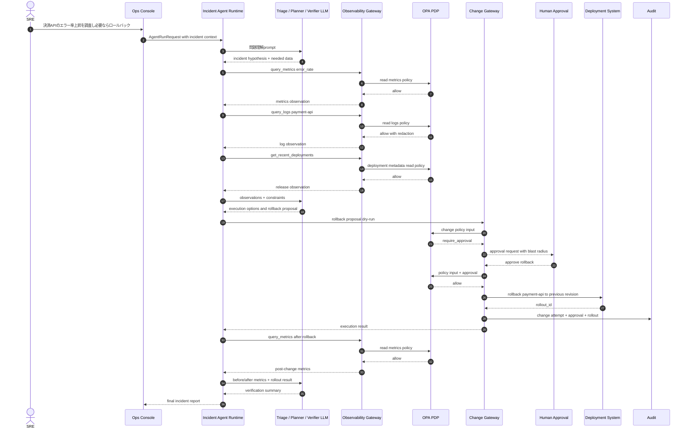
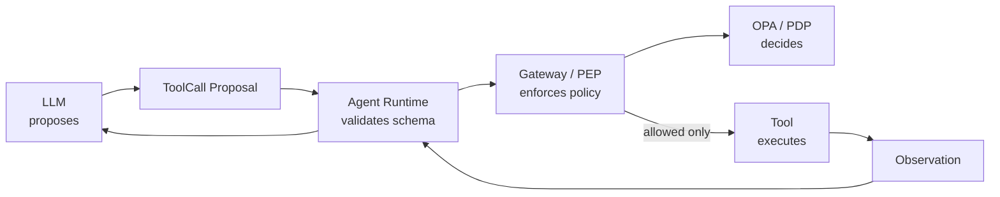

# AIエージェント実行データフロー具体例

作成日: 2026-05-06

## 0. 目的

この資料は、AIエージェントが1つの依頼を処理するときに、どのコンポーネント間で、どのようなデータをやり取りするかを具体化する。

対象とする一連の流れは次の通り。

```text
問題の理解
  -> 調査
  -> 実行案の提示
  -> 実行の判定
  -> 実行
  -> 実行結果の確認
```

ここで重要なのは、LLMが直接実行するのではなく、LLMは構造化された提案を出し、Agent Runtime、Policy Gate、Tool Gateway、MCP Gatewayなどが検証・判定・実行する点である。

## 1. 共通コンポーネント



## 2. 共通データモデル

### 2.1 実行開始リクエスト

```json
{
  "run_id": "run_20260506_001",
  "session_id": "sess_abc",
  "user": {
    "user_id": "u001",
    "department": "engineering",
    "roles": ["developer"]
  },
  "agent": {
    "agent_id": "workspace_editor",
    "version": "2026.05.06"
  },
  "task": {
    "instruction": "README.mdにセットアップ手順を追記して",
    "purpose": "documentation_update",
    "risk_hint": "low"
  },
  "environment": {
    "tenant_id": "tenant_a",
    "workspace": "/workspace/project",
    "locale": "ja-JP"
  }
}
```

### 2.2 Agent State

Agent Runtimeは、LLM呼び出し結果とツール実行結果をすべて`AgentState`へ蓄積する。

```json
{
  "run_id": "run_20260506_001",
  "status": "planning",
  "user_instruction": "README.mdにセットアップ手順を追記して",
  "understanding": null,
  "research_queries": [],
  "observations": [],
  "plan": null,
  "next_tool_call": null,
  "policy_decisions": [],
  "attempts": [],
  "verification": null,
  "final_response": null,
  "step_count": 0
}
```

### 2.3 ToolCall

LLMが作るのは実行結果ではなく、実行候補である。

```json
{
  "tool_call_id": "tc_001",
  "name": "read_file",
  "arguments": {
    "path": "README.md"
  },
  "reason": "現在のREADME内容を確認し、追記位置を判断する",
  "risk": {
    "side_effect": false,
    "data_classification": "internal",
    "risk_tier": "low"
  }
}
```

### 2.4 Policy Input / Decision

```json
{
  "subject": {
    "user_id": "u001",
    "agent_id": "workspace_editor",
    "roles": ["developer"]
  },
  "request": {
    "run_id": "run_20260506_001",
    "tool_call_id": "tc_001",
    "purpose": "documentation_update"
  },
  "action": {
    "type": "tool_call",
    "tool": "read_file",
    "operation": "read",
    "side_effect": false
  },
  "resource": {
    "system": "workspace_file",
    "path": "README.md",
    "classification": "internal"
  },
  "context": {
    "environment": "dev",
    "approval_present": false
  }
}
```

```json
{
  "decision_id": "dec_001",
  "decision": "allow",
  "allow": true,
  "requires_human_approval": false,
  "reasons": [],
  "constraints": {
    "max_bytes": 1048576
  }
}
```

### 2.5 Observation / Attempt

```json
{
  "attempt_id": "att_001",
  "tool_call_id": "tc_001",
  "tool": "read_file",
  "arguments": {
    "path": "README.md"
  },
  "policy_decision_id": "dec_001",
  "execution": {
    "status": "success",
    "started_at": "2026-05-06T15:00:00+09:00",
    "finished_at": "2026-05-06T15:00:01+09:00"
  },
  "observation": {
    "type": "file_content",
    "path": "README.md",
    "sha256": "before_hash",
    "content_excerpt": "# Project\n\n..."
  }
}
```

## 3. パターン1: ファイル編集エージェント

### 3.1 ユースケース

ユーザー依頼:

```text
README.mdにPython 3.13とuvを使ったセットアップ手順を追記して。
```

このパターンは、比較的低リスクなワークスペース内ファイル編集である。ただし、ファイル読み取り、書き込み、差分検証、OPA判定は必ず通す。

### 3.2 コンポーネント図



### 3.3 シーケンス図



### 3.4 データの流れ

#### 1. 問題の理解

入力:

```json
{
  "instruction": "README.mdにPython 3.13とuvを使ったセットアップ手順を追記して",
  "workspace": "/workspace/project",
  "available_tools": ["list_files", "read_file", "patch_file", "write_file"]
}
```

LLM出力:

```json
{
  "intent": "documentation_update",
  "target_resources": ["README.md"],
  "required_information": [
    "README.mdの既存構成",
    "追記すべきセットアップ手順"
  ],
  "risk_assessment": {
    "side_effect": true,
    "risk_tier": "medium",
    "reason": "ファイル更新を伴う"
  }
}
```

#### 2. 調査

ToolCall:

```json
{
  "tool_call_id": "tc_101",
  "name": "read_file",
  "arguments": {
    "path": "README.md"
  },
  "reason": "既存のREADME構成と追記位置を確認する"
}
```

Observation:

```json
{
  "tool_call_id": "tc_101",
  "status": "success",
  "observation": {
    "path": "README.md",
    "sha256": "9b11...",
    "content": "# Project\n\n## Usage\n\n..."
  }
}
```

#### 3. 実行案の提示

ExecutionPlan:

```json
{
  "plan_id": "plan_101",
  "summary": "README.mdにuvを使ったセットアップ手順を追記する",
  "operations": [
    {
      "operation_id": "op_001",
      "type": "patch_file",
      "path": "README.md",
      "reason": "セットアップ手順をREADMEに追加する",
      "expected_sha256_before": "9b11...",
      "old_text": "## Usage\n\n",
      "new_text": "## Setup\n\n```bash\nuv sync\nuv run python --version\n```\n\n## Usage\n\n"
    }
  ]
}
```

#### 4. 実行の判定

Policy Input:

```json
{
  "subject": {
    "user_id": "u001",
    "agent_id": "workspace_editor"
  },
  "action": {
    "tool": "patch_file",
    "operation": "write",
    "side_effect": true
  },
  "resource": {
    "path": "README.md",
    "extension": ".md",
    "classification": "internal",
    "expected_sha256_before": "9b11..."
  },
  "constraints": {
    "workspace_only": true,
    "max_change_lines": 80
  }
}
```

Decision:

```json
{
  "decision_id": "dec_101",
  "decision": "allow",
  "allow": true,
  "constraints": {
    "require_hash_match": true,
    "max_change_lines": 80
  },
  "reasons": []
}
```

#### 5. 実行

Gateway Attempt:

```json
{
  "attempt_id": "att_101",
  "operation_id": "op_001",
  "operation_type": "patch_file",
  "path": "README.md",
  "sha256_before": "9b11...",
  "sha256_after": "d82c...",
  "policy_decision_id": "dec_101",
  "execution": {
    "status": "success"
  },
  "diff_preview": "+ ## Setup\n+ uv sync\n+ uv run python --version"
}
```

#### 6. 実行結果の確認

Verification:

```json
{
  "ok": true,
  "checked_paths": ["README.md"],
  "summary": "README.mdにuvを使ったセットアップ手順が追記され、Gatewayのハッシュ検証も成功した",
  "issues": []
}
```

## 4. パターン2: 社内データ調査と外部送信

### 4.1 ユースケース

ユーザー依頼:

```text
顧客Aの直近3件の問い合わせを調査して、返信案を作り、承認後にメール送信して。
```

このパターンでは、調査は読み取り中心だが、メール送信は外部送信であり高リスクである。RAG/MCP/CRMから取得した情報を、LLMが文脈として使う。送信前にはOPA判定と人間承認を必須にする。

### 4.2 コンポーネント図



### 4.3 シーケンス図



### 4.4 データの流れ

#### 1. 問題の理解

```json
{
  "intent": "customer_support_response",
  "target_entities": {
    "customer_name": "顧客A"
  },
  "required_information": [
    "直近3件の問い合わせ",
    "問い合わせのステータス",
    "過去回答",
    "送信先メールアドレス"
  ],
  "planned_outputs": [
    "返信案",
    "承認要求",
    "承認後のメール送信"
  ],
  "risk_assessment": {
    "data_access": "customer_confidential",
    "egress": true,
    "risk_tier": "high"
  }
}
```

#### 2. 調査

MCP ToolCall:

```json
{
  "tool_call_id": "tc_201",
  "server": "crm_mcp",
  "name": "search_customer_cases",
  "arguments": {
    "customer_name": "顧客A",
    "limit": 3,
    "sort": "created_at_desc"
  },
  "reason": "返信案作成に必要な直近問い合わせを取得する"
}
```

Data Policy Decision:

```json
{
  "decision_id": "dec_201",
  "decision": "allow_with_constraints",
  "allow": true,
  "constraints": {
    "max_rows": 3,
    "redact_fields": ["phone_number", "payment_card", "access_token"],
    "allowed_fields": [
      "case_id",
      "subject",
      "summary",
      "status",
      "last_response",
      "created_at"
    ]
  }
}
```

Observation:

```json
{
  "tool_call_id": "tc_201",
  "status": "success",
  "observation": {
    "records": [
      {
        "case_id": "case_301",
        "subject": "ログインできない",
        "summary": "SSO設定後にログイン不可",
        "status": "open",
        "last_response": "IdP設定を確認するよう案内済み",
        "created_at": "2026-05-05T10:12:00+09:00"
      }
    ],
    "redactions_applied": ["phone_number", "payment_card", "access_token"]
  }
}
```

#### 3. 実行案の提示

LLMが返信案と送信候補を作る。

```json
{
  "plan_id": "plan_201",
  "summary": "直近問い合わせを踏まえて、SSO設定確認と追加情報依頼の返信を送る",
  "draft": {
    "to": "customer-a@example.com",
    "subject": "SSOログイン不可の件について",
    "body": "顧客A様\n\n直近のお問い合わせを確認しました..."
  },
  "operations": [
    {
      "operation_id": "op_201",
      "type": "send_email",
      "tool": "email.send",
      "arguments": {
        "to": "customer-a@example.com",
        "subject": "SSOログイン不可の件について",
        "body_ref": "draft.body"
      },
      "reason": "承認済みの返信案を顧客へ送信する"
    }
  ]
}
```

#### 4. 実行の判定

Egress Policy Input:

```json
{
  "subject": {
    "user_id": "support_lead_01",
    "agent_id": "customer_support_agent"
  },
  "action": {
    "tool": "email.send",
    "operation": "external_send",
    "side_effect": true
  },
  "resource": {
    "recipient_domain": "example.com",
    "data_classification": "customer_confidential",
    "contains_personal_data": true
  },
  "request": {
    "run_id": "run_20260506_201",
    "operation_id": "op_201"
  },
  "approval": {
    "present": false
  }
}
```

Decision:

```json
{
  "decision_id": "dec_202",
  "decision": "require_approval",
  "allow": false,
  "requires_human_approval": true,
  "reasons": [
    "External email containing customer confidential data requires approval"
  ],
  "constraints": {
    "allowed_approvers": ["support_lead", "support_manager"]
  }
}
```

#### 5. 承認と実行

Approval Payload:

```json
{
  "approval_id": "appr_201",
  "decision": "approve",
  "approved_by": "support_lead_01",
  "approved_at": "2026-05-06T15:20:00+09:00",
  "approved_operation_id": "op_201",
  "approved_body_sha256": "body_hash_123"
}
```

Execution Result:

```json
{
  "attempt_id": "att_201",
  "operation_id": "op_201",
  "policy_decision_id": "dec_203",
  "approval_id": "appr_201",
  "execution": {
    "status": "success",
    "provider": "mail",
    "message_id": "msg_789"
  }
}
```

#### 6. 実行結果の確認

```json
{
  "ok": true,
  "summary": "顧客Aの直近問い合わせを踏まえた返信を承認後に送信した",
  "checked_items": [
    "case_301",
    "message_id:msg_789",
    "approval_id:appr_201"
  ],
  "issues": []
}
```

## 5. パターン3: 本番運用変更エージェント

### 5.1 ユースケース

ユーザー依頼:

```text
決済APIのエラー率が上がっている。ログと直近リリースを調査し、必要なら安全にロールバックして。
```

このパターンは高リスクである。調査は読み取り、実行案は複数案、実行は本番変更である。AIエージェントはロールバックを提案できるが、実行前にOPA判定と人間承認、実行後にメトリクス確認が必要になる。

### 5.2 コンポーネント図



### 5.3 シーケンス図



### 5.4 データの流れ

#### 1. 問題の理解

```json
{
  "intent": "incident_triage_and_possible_remediation",
  "service": "payment-api",
  "symptom": "error_rate_increase",
  "required_information": [
    "現在のエラー率",
    "過去1時間のログ",
    "直近デプロイ履歴",
    "依存サービスの状態",
    "ロールバック可能なリビジョン"
  ],
  "risk_assessment": {
    "environment": "prod",
    "side_effect_possible": true,
    "risk_tier": "critical"
  }
}
```

#### 2. 調査

Metrics ToolCall:

```json
{
  "tool_call_id": "tc_301",
  "name": "query_metrics",
  "arguments": {
    "service": "payment-api",
    "metric": "5xx_rate",
    "window": "60m"
  },
  "reason": "エラー率の上昇タイミングと規模を確認する"
}
```

Observation:

```json
{
  "tool_call_id": "tc_301",
  "status": "success",
  "observation": {
    "metric": "5xx_rate",
    "baseline": "0.2%",
    "current": "5.8%",
    "started_at": "2026-05-06T14:42:00+09:00"
  }
}
```

Release Observation:

```json
{
  "tool_call_id": "tc_303",
  "status": "success",
  "observation": {
    "deployments": [
      {
        "service": "payment-api",
        "revision": "rev_1042",
        "deployed_at": "2026-05-06T14:35:00+09:00",
        "previous_revision": "rev_1041",
        "rollback_supported": true
      }
    ]
  }
}
```

#### 3. 実行案の提示

LLMは単一案ではなく、根拠と代替案を含める。

```json
{
  "plan_id": "plan_301",
  "summary": "エラー率上昇はrev_1042のデプロイ直後に発生しており、rev_1041へのロールバックを第一候補とする",
  "evidence": [
    "5xx_rateが14:42から0.2% -> 5.8%へ上昇",
    "rev_1042は14:35にデプロイ",
    "ログに新しい決済バリデーションエラーが増加"
  ],
  "options": [
    {
      "option_id": "opt_rollback",
      "action": "rollback",
      "target_revision": "rev_1041",
      "expected_effect": "エラー率をデプロイ前水準へ戻す",
      "risk": "本番変更"
    },
    {
      "option_id": "opt_monitor",
      "action": "monitor_only",
      "expected_effect": "追加変更なし",
      "risk": "復旧遅延"
    }
  ],
  "recommended_operation": {
    "operation_id": "op_301",
    "type": "rollback_deployment",
    "service": "payment-api",
    "from_revision": "rev_1042",
    "to_revision": "rev_1041",
    "reason": "デプロイ直後にエラー率が上昇し、ロールバック可能なため"
  }
}
```

#### 4. 実行の判定

Change Policy Input:

```json
{
  "subject": {
    "user_id": "sre_01",
    "agent_id": "incident_agent",
    "roles": ["sre_oncall"]
  },
  "action": {
    "tool": "rollback_deployment",
    "operation": "prod_change",
    "side_effect": true,
    "risk_tier": "critical"
  },
  "resource": {
    "service": "payment-api",
    "environment": "prod",
    "from_revision": "rev_1042",
    "to_revision": "rev_1041"
  },
  "evidence": {
    "error_rate_current": "5.8%",
    "rollback_supported": true,
    "recent_deploy_correlation": true
  },
  "approval": {
    "present": false
  }
}
```

Decision:

```json
{
  "decision_id": "dec_301",
  "decision": "require_approval",
  "allow": false,
  "requires_human_approval": true,
  "reasons": [
    "Production rollback requires explicit SRE approval"
  ],
  "constraints": {
    "allowed_approvers": ["sre_oncall", "incident_commander"],
    "require_dry_run": true,
    "post_check_window_minutes": 15
  }
}
```

#### 5. 承認と実行

```json
{
  "approval_id": "appr_301",
  "decision": "approve",
  "approved_by": "sre_01",
  "approved_at": "2026-05-06T15:35:00+09:00",
  "approved_operation_id": "op_301",
  "approved_service": "payment-api",
  "approved_target_revision": "rev_1041"
}
```

Execution Result:

```json
{
  "attempt_id": "att_301",
  "operation_id": "op_301",
  "operation_type": "rollback_deployment",
  "policy_decision_id": "dec_302",
  "approval_id": "appr_301",
  "execution": {
    "status": "success",
    "rollout_id": "rollout_9001",
    "started_at": "2026-05-06T15:36:00+09:00",
    "finished_at": "2026-05-06T15:41:00+09:00"
  },
  "result": {
    "service": "payment-api",
    "active_revision": "rev_1041"
  }
}
```

#### 6. 実行結果の確認

Post-check Observation:

```json
{
  "tool_call_id": "tc_304",
  "status": "success",
  "observation": {
    "metric": "5xx_rate",
    "before_change": "5.8%",
    "after_change": "0.4%",
    "window": "15m",
    "slo_recovered": true
  }
}
```

Verification:

```json
{
  "ok": true,
  "summary": "rev_1041へのロールバック後、payment-apiの5xx率は5.8%から0.4%へ低下し、SLO範囲へ復帰した",
  "checked_items": [
    "rollout_9001",
    "payment-api active_revision rev_1041",
    "post_change_5xx_rate 0.4%"
  ],
  "remaining_risks": [
    "根本原因分析とrev_1042の修正は別途必要"
  ]
}
```

## 6. 3パターンの比較

| 観点 | パターン1: ファイル編集 | パターン2: 社内調査と外部送信 | パターン3: 本番運用変更 |
|---|---|---|---|
| 主な目的 | ドキュメント更新 | 顧客情報調査と返信 | 障害調査と復旧 |
| 調査対象 | ファイル | CRM/MCP/問い合わせ履歴 | メトリクス、ログ、デプロイ履歴 |
| 主要Tool | read_file, patch_file | search_customer_cases, send_email | query_metrics, query_logs, rollback_deployment |
| 主なリスク | 誤編集、範囲外ファイル更新 | 個人情報、顧客機密、外部送信 | 本番停止、誤ロールバック |
| 実行判定 | OPAでワークスペース、拡張子、差分を判定 | OPAでデータアクセスと外部送信を判定 | OPAで本番変更と承認者を判定 |
| HITL | 通常不要。削除なら必要 | 送信前に必要 | 本番変更前に必須 |
| 確認方法 | 差分、sha256、再読込、LLM確認 | message_id、承認ID、送信内容ハッシュ | rollout_id、active revision、メトリクス改善 |

## 7. 実装上の要点

### 7.1 LLMが扱うべきデータ

LLMに渡してよいのは、目的達成に必要な最小限の文脈である。

```json
{
  "instruction": "ユーザー依頼",
  "constraints": {
    "allowed_tools": ["read_file", "patch_file"],
    "forbidden_actions": ["delete_file_without_approval"],
    "data_handling": ["do_not_expose_secrets"]
  },
  "observations": [
    {
      "tool": "read_file",
      "summary": "README.mdの現在内容",
      "content_excerpt": "必要部分のみ"
    }
  ],
  "required_output_schema": "ExecutionPlan"
}
```

### 7.2 LLMに任せてはいけないデータ

以下はLLMの自然言語判断ではなく、Runtime/Gateway/OPAで扱う。

| データ | 扱う場所 |
|---|---|
| 生の資格情報、APIキー、長命トークン | Secret Manager / Token Broker |
| 最終的な認可判断 | OPA / PDP |
| ファイルパス正規化、パストラバーサル検出 | File Gateway |
| 本番変更の承認者判定 | OPA + Approval Service |
| 送信済み証跡、監査ログ | Audit Store |
| 実行後の機械的検証 | Gateway / Runtime |

### 7.3 実装で最も大事な境界



LLMは`ToolCall Proposal`を作る。実行はGatewayが行う。判定はOPAが行う。結果はObservationとしてStateに戻る。この分離が、3つのパターンすべてに共通する実装上の芯である。

