# エンタープライズAIエージェント設計資料

作成日: 2026-05-06

## 0. エグゼクティブサマリ

AIエージェントを企業システムへ導入する本質的な難しさは、単にLLMを使うことではない。非決定的な推論を行うソフトウェアに、企業データ、ID、業務API、ファイル、SaaS、実行権限を接続する点にある。

したがって設計の中心は、LLMの賢さではなく、次の5点である。

1. LLMを認可主体にしない。
2. ツール実行前に、決定論的なPolicy Enforcement Pointを必ず通す。
3. MCPなどのツール接続は、標準化と同時に新しい攻撃面として扱う。
4. OPAはPolicy Decision Pointとして配置し、Agent Runtime、Tool Gateway、MCP Gateway、API Gateway、Kubernetes AdmissionなどをPolicy Enforcement Pointにする。
5. エンタープライズ導入では、ID、権限、データ境界、監査、評価、運用、責任分界を業務統制として設計する。

本資料では、PythonでAIエージェントを記述する場合の標準コンポーネント、LLM/Tool/MCPの連携、OPAによる事前ポリシー判定の推奨構成、エンタープライズ導入時の根本課題を整理する。

## 1. 前提と用語

| 用語 | 本資料での意味 |
|---|---|
| AIエージェント | LLMを使って計画、判断、ツール呼び出し、結果確認を行うアプリケーション |
| LLM | 推論、計画、構造化出力、ツール選択を行うモデル |
| Tool | エージェントが呼び出せる関数、API、DB、ファイル操作、SaaS操作など |
| MCP | Model Context Protocol。AIアプリと外部ツール/データ/プロンプトを接続する標準プロトコル |
| OPA | Open Policy Agent。Regoで記述したポリシーを評価する汎用ポリシーエンジン |
| PDP | Policy Decision Point。許可/拒否/条件を判断する場所 |
| PEP | Policy Enforcement Point。リクエストを止め、PDPに問い合わせ、結果を強制する場所 |
| HITL | Human-in-the-loop。危険操作や不確実な判断で人間承認を挟む仕組み |

## 2. Pythonで書くAIエージェントの全体構成

PythonでAIエージェントを実装する場合、LLMを直接呼び出す薄いスクリプトではなく、実行制御、ツール制御、状態管理、ポリシー判定、監査を含むランタイムとして設計する。

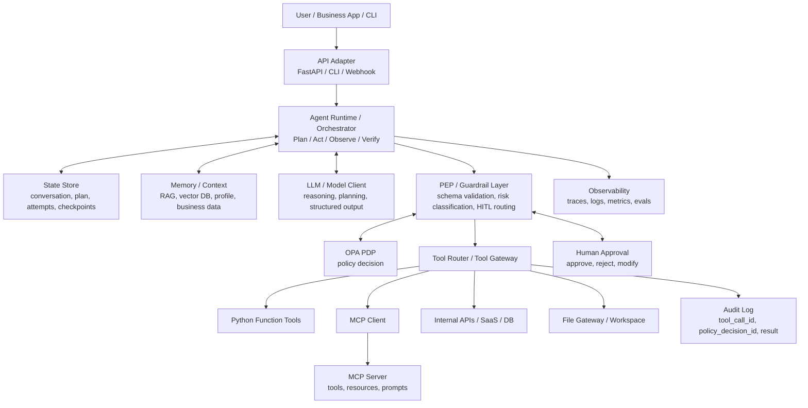

### 2.1 コンポーネントごとの責務

| コンポーネント | 主な責務 | 注意点 |
|---|---|---|
| API Adapter | ユーザー入力、認証済み主体、セッション、UI応答を扱う | ユーザー入力をそのままツールに渡さない |
| Agent Runtime | LLM呼び出し、計画、ツール選択、ループ、終了判定、再試行を制御 | LLMの出力を「提案」として扱い、実行は別層で検証する |
| LLM Client | 推論、ツール選択、JSON出力、検証コメントを生成 | 認可判断、最終的な安全判断を任せない |
| Memory / Context | 会話履歴、RAG、業務データ、過去結果を提供 | 検索対象、返却列、PII、ログ保持を管理する |
| Tool Router | ツール定義、スキーマ検証、タイムアウト、再試行、結果整形を行う | ここを主要なPEPにする |
| MCP Client | MCP Serverとのセッション、tools/list、tools/call、resources/readを扱う | MCP Serverごとに権限と認可境界を分ける |
| Policy / PEP Layer | OPA問い合わせ、HITL判定、出力制約、リスク分類を行う | PEPは判定を強制し、判断自体はOPAなどのPDPに委譲する |
| State Store | 実行状態、計画、承認待ち、チェックポイントを保持 | 長時間実行と監査再現性の前提になる |
| Observability | LLM入出力、ツール呼び出し、承認、エラー、コストを記録 | 機密情報をログに残す場合はマスキングと保持期限を設計する |

OpenAI Agents SDKの公式ドキュメントでも、エージェントは「計画し、ツールを呼び出し、専門エージェントと協調し、複数ステップの作業を完了するだけの状態を保持するアプリケーション」と説明されている。また、SDKを使う場合はアプリケーション側がオーケストレーション、ツール実行、承認、状態を所有する構成が想定されている。

### 2.2 コード上のAIエージェント構成

実装の感触としては、「いろいろな役割を持ったLLMがツール実行を提案し、アプリ側が実行結果を観測として受け取り、再度LLMに渡して推論する」という理解でほぼ正しい。ただし、実装上はLLMそのものがツールを実行するのではなく、LLMは`ToolCall`を提案し、Runtime/Gatewayが検証・認可・実行・監査を行う。

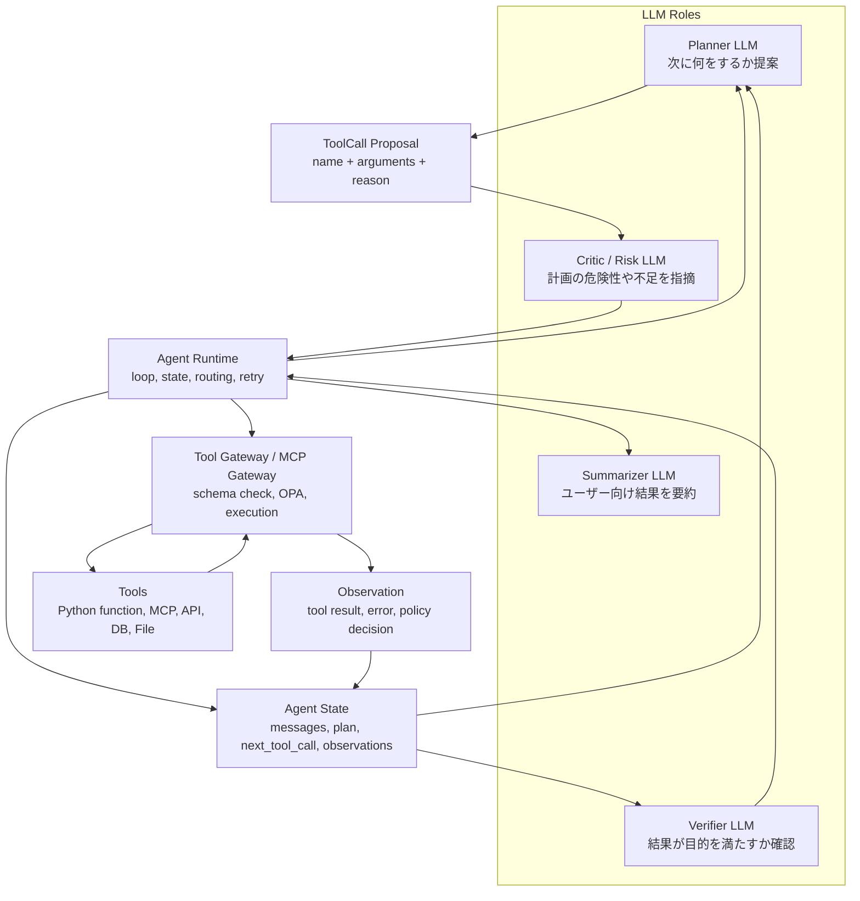

コード上の最小単位は、次のように分けると理解しやすい。

| 概念 | コード上の形 | 役割 |
|---|---|---|
| `AgentState` | `TypedDict`、Pydantic model、dataclass | 会話、計画、次のtool call、観測、承認状態、試行回数を保持 |
| `Planner` | LLM呼び出し関数、`with_structured_output`、tool-calling model | 次に呼びたいツールと引数を構造化して提案 |
| `ToolCall` | `{name, arguments, reason}` | LLMの実行提案。まだ実行結果ではない |
| `Tool Router` | tool名から関数/MCP/APIへ振り分けるコード | スキーマ検証、タイムアウト、リトライ、結果整形を担当 |
| `Policy Gate` | OPA client、guardrail、approval router | 実行前に許可/拒否/承認要求を判定 |
| `Tool Executor` | Python関数、MCP Client、HTTP client、DB client | 実際に副作用を発生させる |
| `Observation` | tool result、error、decision_id、diff、hash | 次のLLM推論へ戻す観測結果 |
| `Verifier` | LLMまたは決定論的検証 | ユーザー目的を満たしたか、追加修正が必要か判断 |

この形にすると、LLMの役割は複数に分けられる。

1. `Planner LLM`: ユーザー指示と現在状態から、次の`ToolCall`を1つまたは複数提案する。
2. `Critic / Risk LLM`: 計画が荒すぎないか、危険操作がないか、情報不足がないかを指摘する。ただし最終認可はOPAなどのPDPに任せる。
3. `Verifier LLM`: 実行結果、差分、Gateway検証を見て、目的達成を確認する。
4. `Summarizer LLM`: 実行の詳細を、ユーザー向けの短い報告に変換する。

ただし最初からLLMを4つに分ける必要はない。MVPでは、同じモデルを`Planner`と`Verifier`として2回呼ぶだけでも十分に構成を掴める。重要なのは、役割をクラスや関数として分け、`ToolCall`と`Observation`を明示的なデータ構造にすることである。

### 2.3 LangChain / LangGraphで明示する場合

LangChainとLangGraphの使い分けは、次のように考えるとよい。

| 使うもの | 向いている責務 | この資料での対応 |
|---|---|---|
| LangChain `ChatModel` | LLM呼び出し、tool calling、structured output | Planner LLM、Verifier LLM |
| LangChain `@tool` / tool schema | Python関数をツールとして定義 | Python Function Tools |
| MCP Client | 外部MCP Serverからtools/resources/promptsを取得 | MCP Client / MCP Gateway |
| LangGraph `StateGraph` | ノード、エッジ、条件分岐、ループを明示 | Agent Runtime |
| LangGraph checkpoint | thread_id単位の状態保存、再開、障害復旧 | State Store |
| LangGraph interrupt | human-in-the-loopの一時停止と再開 | Human Approval |
| LangSmith / tracing | 実行トレース、評価、デバッグ | Observability |

LangChainだけでも小さなエージェントは書けるが、企業向けに「どこで計画し、どこで認可し、どこで実行し、どこで承認待ちにし、どこで検証するか」を説明したい場合は、LangGraphの`StateGraph`でノードを分けた方が読みやすい。LangGraph公式ドキュメントでも、workflowsは事前定義されたコード経路、agentsは動的にプロセスとツール利用を決めるものとして整理され、StateGraph、条件分岐、checkpoint、interruptが主要部品として説明されている。

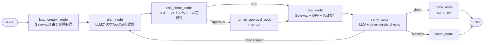

LangGraph風に書くと、骨格は次のようになる。

```python
from typing import Literal, TypedDict

from langgraph.graph import END, START, StateGraph
from langgraph.checkpoint.memory import InMemorySaver
from langgraph.types import Command, interrupt


class AgentState(TypedDict, total=False):
    user_instruction: str
    messages: list[dict]
    next_tool_call: dict | None
    observations: list[dict]
    needs_human_approval: bool
    approval_request: dict | None
    final_answer: str | None
    step_count: int


def plan_node(state: AgentState) -> AgentState:
    # LLM returns structured ToolCall or final answer.
    return {"next_tool_call": {"name": "read_file", "args": {"path": "README.md"}}}


def tool_node(state: AgentState) -> AgentState:
    # Gateway is the only place that can execute tools.
    # Gateway internally does schema checks, OPA decision, execution, audit.
    observation = gateway.execute(state["next_tool_call"])
    return {"observations": [observation], "next_tool_call": None}


def human_approval_node(state: AgentState) -> Command:
    approval = interrupt(state["approval_request"])
    return Command(update={"approval_result": approval}, goto="tool")


def route_after_plan(state: AgentState) -> Literal["tool", "human_approval", "done"]:
    if state.get("needs_human_approval"):
        return "human_approval"
    if state.get("next_tool_call"):
        return "tool"
    return "done"


builder = StateGraph(AgentState)
builder.add_node("plan", plan_node)
builder.add_node("tool", tool_node)
builder.add_node("human_approval", human_approval_node)
builder.add_node("done", lambda state: state)
builder.add_edge(START, "plan")
builder.add_conditional_edges("plan", route_after_plan)
builder.add_edge("tool", "plan")
builder.add_edge("done", END)

graph = builder.compile(checkpointer=InMemorySaver())
```

このコードで一番大事なのは、`tool_node`以外からツール実行をさせないことである。LLMは`next_tool_call`を作るだけ、GatewayがOPA判定と実行を担う、という境界をコードに落とす。

## 3. 標準実行フロー

エージェントの実行は、LLMの単発応答ではなく、Plan -> Authorize -> Act -> Observe -> Verifyのループとして扱う。

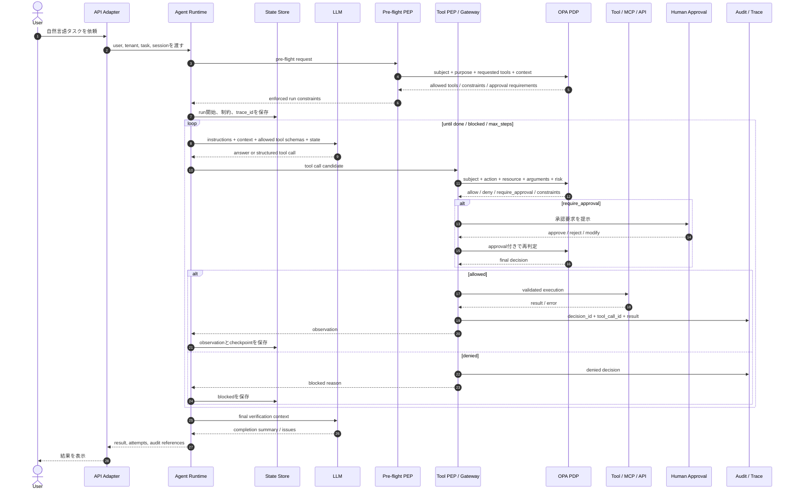

このフローの重要点は、LLMが出したtool callをそのまま実行しないことである。LLMは「何をしたいか」を提案し、OPAなどのPDPが「許可・拒否・承認要求」を判定し、PEPであるTool GatewayやMCP Gatewayがその結果を強制する。

## 4. LLM / Tool / MCPの連携

### 4.1 通常のTool Calling

LLM APIのTool CallingまたはFunction Callingでは、アプリケーションが関数定義をモデルに渡し、モデルが関数名とJSON引数を返す。実際の関数実行、認証、権限、エラー処理、監査はアプリケーション側が担う。

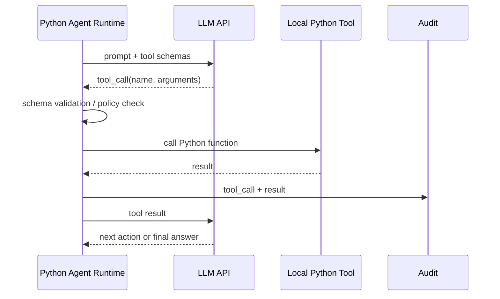

この方式は実装が単純だが、ツール一覧や認可をアプリごとに実装しやすく、エンタープライズ全体での再利用、監査、権限統制が散らばりやすい。

### 4.2 MCPの役割

MCPは、AIアプリケーションと外部ツール/データ/プロンプトを接続する標準プロトコルである。公式仕様では、MCPはHost、Client、Serverのアーキテクチャを採る。

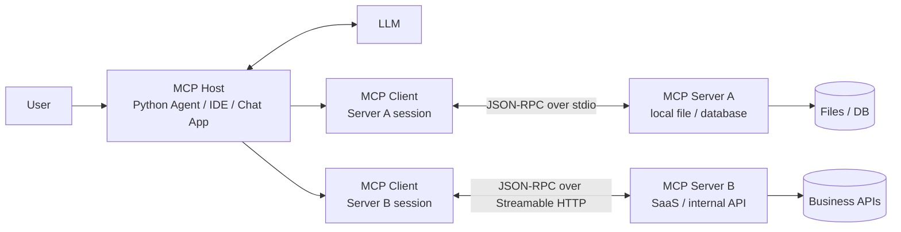

| MCP要素 | 役割 | 代表操作 | 主な制御主体 |
|---|---|---|---|
| Tools | モデルが実行できる関数。副作用を持つことがある | tools/list, tools/call | model-controlled |
| Resources | LLMへ渡す文脈データ。ファイル、DBスキーマ、検索結果など | resources/list, resources/read | application-driven |
| Prompts | 再利用可能なプロンプトテンプレートやワークフロー | prompts/list, prompts/get | user-controlled |

ここでいう`model-controlled`は、モデルがツール利用を提案・選択し得るという意味であり、モデルが直接実行権限を持つという意味ではない。Host、Client、Gateway、PEPが接続権限、ユーザー同意、ポリシー判定、実行制御を担う。

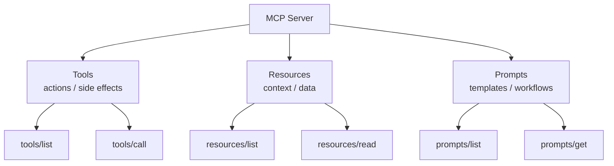

MCPは既存のTool Callingを置き換えるというより、外部機能提供の標準接続レイヤーである。PythonエージェントはMCP Host/ClientとしてMCP Serverを発見し、LLMのtool decisionと組み合わせてtools/callを実行する。

### 4.3 Pythonエージェントから見たMCP連携

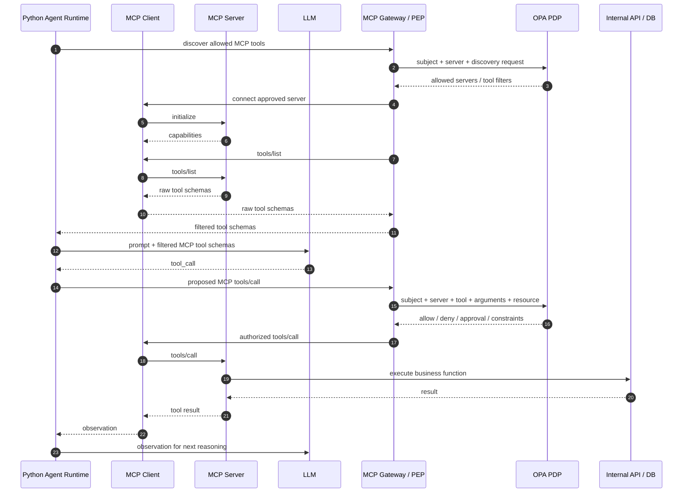

MCP連携の設計ポイントは以下である。

| 論点 | 推奨 |
|---|---|
| Server単位の境界 | MCP Serverを業務ドメインごとに分ける。CRM、ファイル、CI/CD、本番運用などを同一権限にしない |
| tools/listの扱い | ユーザー、テナント、環境、リスクに応じてツール一覧を絞る |
| tools/callの認可 | LLM出力を信用せず、MCP GatewayまたはTool RouterでOPA判定する |
| resources/readの制御 | RAGと同じく、検索対象、返却列、分類ラベル、件数をポリシーで制御する |
| stdio transport | ローカル権限に依存しやすいため、企業環境ではサンドボックス、署名済みServer、許可リストが必要 |
| HTTP transport | OAuth、短命トークン、audience/resource binding、TLS、監査ログを前提にする |
| shadow MCP | 未承認MCP Serverを検出し、利用禁止または隔離する |

## 5. OPAによる実行前ポリシー判定

### 5.1 基本原則

OPAはPDPであり、許可/拒否/条件付き許可を判断する。AIエージェント、Tool Gateway、MCP Gateway、API Gateway、Envoy、Kubernetes Admission ControllerなどがPEPとして動き、OPAの判断を強制する。

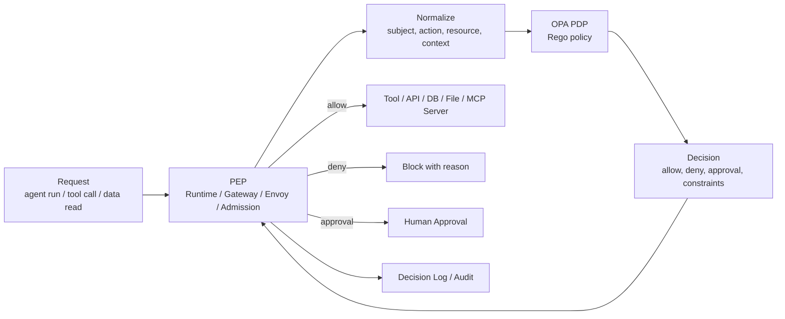

最も重要な原則は、OPAに自然言語を評価させないことである。OPAへの入力は、ユーザー、エージェント、ツール、対象リソース、操作種別、引数、データ分類、承認情報、リスクなどを正規化したJSONにする。

### 5.2 AIエージェントでの判定ポイント

| 判定ポイント | タイミング | 例 | 主なPEP |
|---|---|---|---|
| Pre-flight authorization | エージェント実行開始前 | このユーザーがこのエージェントをこの用途で起動できるか | Agent Runtime |
| Tool discovery filtering | LLMへツール一覧を渡す前 | CRM write toolを見せるか、readだけにするか | Tool Router / MCP Gateway |
| Tool call authorization | 各ツール実行直前 | send_email、delete_file、deploy_prodを許可するか | Tool Gateway / MCP Gateway |
| Data access policy | RAG、DB、ファイル読み取り前 | PII列、機密文書、部門外データを返してよいか | Data Gateway |
| Egress policy | 外部送信直前 | Slack投稿、メール送信、チケット更新、外部API送信 | Output Gateway |
| Human approval | 危険操作の直前 | 削除、金銭、契約、本番変更、個人情報大量出力 | Approval Service |
| Post-action verification | 実行後 | 変更差分、ハッシュ、対象件数、送信先を確認 | Gateway / Runtime |

### 5.3 OPAの配置パターン

| 配置 | 使いどころ | 長所 | 注意点 |
|---|---|---|---|
| Application sidecar | エージェントRuntimeやTool Gatewayの隣に配置 | 低遅延、ネットワーク障害に強い、アプリ単位で制御しやすい | ポリシー配布とバージョン管理が必要 |
| Service mesh sidecar / Envoy ext_authz | HTTP/gRPC APIを横断制御 | アプリ改修を抑えられる。L7で強制しやすい | ツール引数や業務文脈を渡さないと粗い判定になる |
| Central OPA service | 複数エージェント/サービスで共通判定 | 管理しやすい。共通データを参照しやすい | 遅延、可用性、単一障害点に注意 |
| External OPA service | クラウド外、オンプレ、複数クラスタ横断 | ハイブリッド環境で使える | ネットワーク障害時のfail-open/fail-closed設計が重要 |
| Kubernetes Admission / Gatekeeper | Pod、Job、Secret、RBAC、Agent Worker作成前 | 危険な実行環境をデプロイ時に止める | 実行中のtool callは止められない |
| CI/CD / Conftest | IaC、ポリシー、MCP Server定義、ツール定義の検査 | 本番前に違反を発見できる | 実行時文脈は見えない |

### 5.4 推奨配置

エンタープライズの本番環境では、単一のOPA配置ではなく、多層PEP + 分散OPA + 中央ポリシー配布を推奨する。

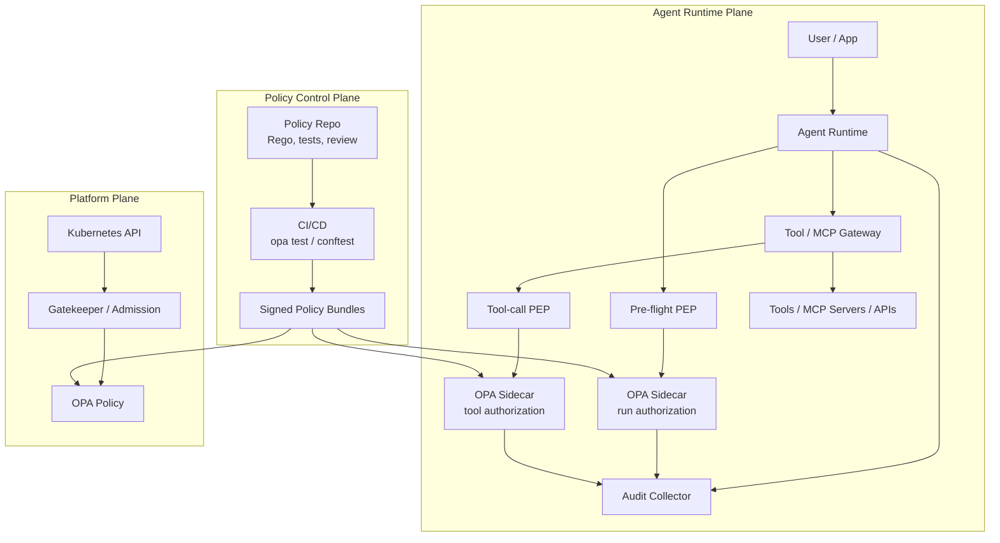

推奨は以下である。

1. エージェント実行前のPre-flight判定はAgent Runtime内または隣接するPre-flight PEPで強制し、判断はOPAに委譲する。
2. 副作用のある操作はTool GatewayまたはMCP Gatewayで必ず実行前同期判定する。
3. OPAは低遅延が必要なRuntime/Gatewayの近くにsidecar配置する。
4. 共通ポリシーはPolicy RepoからBundleで配布し、CI/CDでopa testとレビューを必須にする。
5. KubernetesではGatekeeper/Admissionで、特権Pod、HostPath、Secretマウント、ServiceAccount、外向き通信、未署名イメージを制御する。
6. Decision Logsのdecision_idとAgent Traceのtool_call_id/span_idを相関させる。

### 5.5 OPA入力の例

```json
{
  "subject": {
    "user_id": "u123",
    "tenant_id": "t001",
    "groups": ["sales"],
    "agent_id": "crm_assistant",
    "session_id": "sess_abc"
  },
  "request": {
    "run_id": "run_001",
    "tool_call_id": "tc_009",
    "purpose": "customer_support",
    "environment": "prod"
  },
  "action": {
    "type": "tool_call",
    "tool": "send_email",
    "operation": "send",
    "side_effect": true,
    "risk_tier": "high"
  },
  "resource": {
    "system": "email",
    "recipient_domain": "external.example",
    "data_classification": "confidential",
    "record_count": 3
  },
  "arguments": {
    "has_attachment": true,
    "attachment_classification": "confidential"
  },
  "approval": {
    "present": false,
    "approved_by": null,
    "ticket_id": null
  }
}
```

OPAの出力は単なるbooleanでは足りない。理由、制約、承認要否、マスキング、件数上限などを返す。

```json
{
  "decision": "require_approval",
  "allow": false,
  "requires_human_approval": true,
  "reasons": [
    "External email with confidential attachment requires approval"
  ],
  "constraints": {
    "max_recipients": 1,
    "require_ticket_id": true,
    "redact_fields": ["customer_ssn", "access_token"]
  }
}
```

この例では`allow=false`は「承認なしでは実行不可」という意味であり、最終拒否ではない。実装では`decision`を`allow`、`deny`、`require_approval`、`allow_with_constraints`のように明示し、`deny`と`require_approval`を別分岐で扱う。

### 5.6 OPAはどこにデプロイすべきか

結論として、実行時のツール認可は、AIエージェント本体と同じPodまたは同じノード近傍のOPA sidecarを第一候補にする。理由は、ツール実行直前の認可は低遅延かつ高可用性が必要で、Central OPAへのネットワーク依存が失敗時の危険を増やすためである。

ただし、OPA sidecarだけでは組織横断の管理が散らばる。したがって、ポリシー管理は中央、判定実行は分散という構成にする。

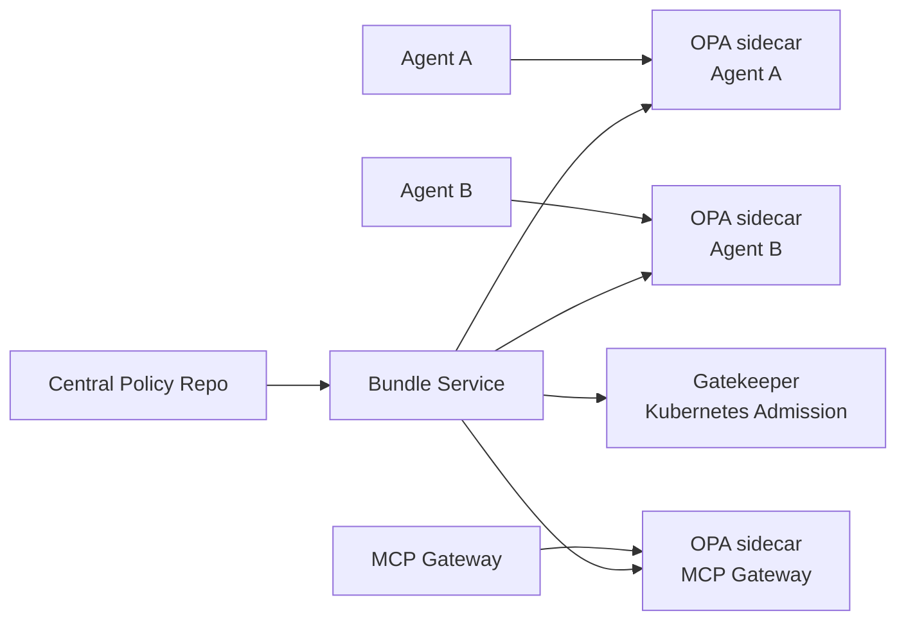

Central OPA serviceは、共通参照データが大きい場合や、多数のPEPから同一判定を使う場合に有効である。ただし本番のtool call認可では、OPA service障害時のfail-closed設計、キャッシュ、タイムアウト、SLOが必須になる。

## 6. 信頼境界と脅威モデル

AIエージェントの脅威モデルは、従来のWebアプリケーションと異なる。LLMは自然言語の命令、取得した外部文書、ツール結果、過去の会話を同じ推論文脈に載せるため、データが命令として作用する可能性がある。したがって信頼境界を、ネットワーク境界だけでなく「どの情報がLLMの文脈に入り、どの情報が実行権限へ接続されるか」で引く必要がある。

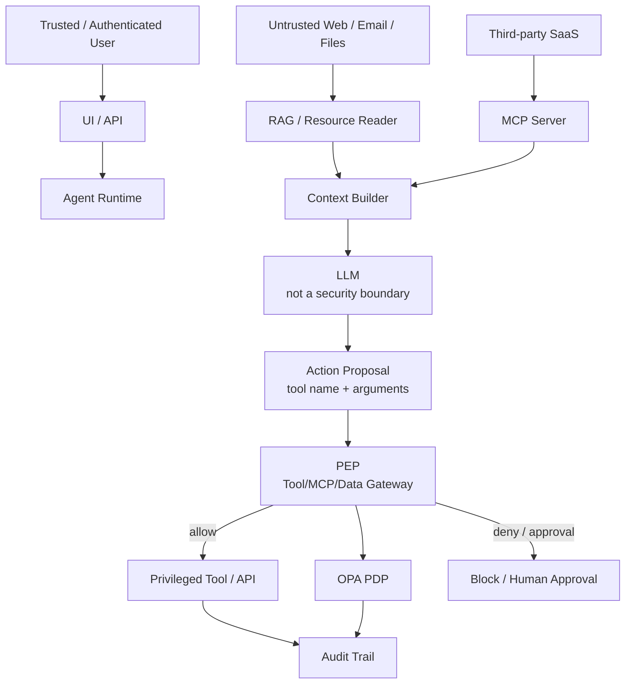

| 信頼境界 | 主な攻撃経路 | 防御策 |
|---|---|---|
| User/API -> Runtime | なりすまし、権限不足ユーザーの実行、目的偽装 | IdP認証、セッション署名、Pre-flight PEP、用途別許可 |
| External Data -> LLM Context | 間接プロンプトインジェクション、context poisoning | 取得元分類、信頼度ラベル、引用元保持、ツール結果を命令として扱わないプロンプト設計 |
| MCP Server -> Host | tool poisoning、shadow MCP、schema poisoning、過剰権限ツール | 承認済みServer allowlist、署名、tools/listフィルタ、OPA判定、ツール説明のレビュー |
| LLM -> Tool Execution | 過剰な代理性、誤実行、confused deputy | LLM出力を提案扱いにし、PEP/PDPで実行前判定する |
| Tool -> Enterprise System | データ漏えい、削除、金銭・契約・本番変更 | 最小権限、HITL、トランザクション上限、dry-run、ロールバック |
| Runtime -> Logs/Evals | 機密情報・PII・シークレットのログ残留 | ログマスキング、保持期限、暗号化、監査用と評価用の分離 |
| Supply Chain -> Runtime | MCP Server、Python依存、コンテナ、プロンプトの改ざん | SBOM、署名済みイメージ、依存関係スキャン、ポリシー/プロンプトのレビューとバージョン管理 |

重要なのは、プロンプトインジェクションを完全に消す前提にしないことである。外部文脈を読むエージェントでは、LLMが意図しない指示の影響を受ける残余リスクがある。そのため、権限を絞り、危険操作をPEPで止め、監査で再現できるようにする。

## 7. ID・委任・トークン設計

企業利用では「誰の権限でエージェントが動くのか」を曖昧にしてはいけない。人間ユーザーの共有IDや長命APIキーをエージェントへ渡す構成は避け、ユーザー、エージェント、ツール、下流APIの権限を分ける。

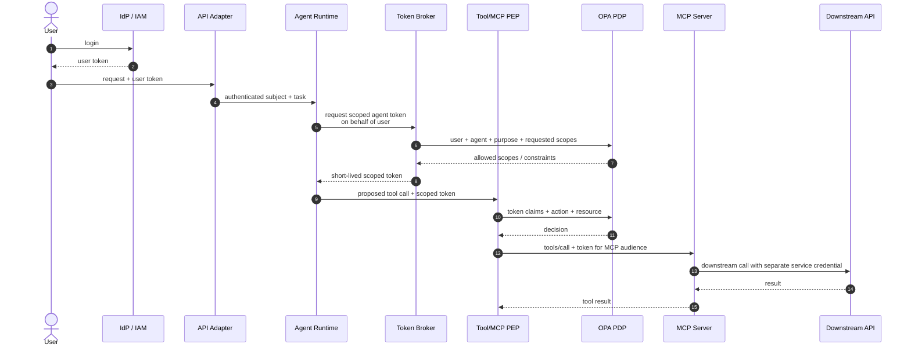

| 設計項目 | 推奨 |
|---|---|
| 人間ユーザー | IdPで認証し、ユーザーID、所属、ロール、テナント、利用目的をRuntimeへ渡す |
| エージェントID | 用途別に個別IDを持たせ、どのエージェントが何を実行したか監査可能にする |
| On-Behalf-Of | ユーザー権限をそのままコピーせず、ユーザー、エージェント、用途、環境を合わせてスコープを縮小する |
| 短命トークン | tool call単位または短時間で失効するトークンを発行し、長命APIキーをLLM文脈に入れない |
| audience/resource binding | MCP ServerやAPIごとにトークンの対象を固定し、別Serverへの流用を防ぐ |
| 秘密情報管理 | Secret Manager、KMS、Workload Identityを使い、プロンプト、ログ、ツール結果へ秘密情報を出さない |
| 権限棚卸し | エージェントID、MCP Server、ツール、下流APIの権限を定期的にレビューする |

この設計では、LLMは資格情報を保持しない。RuntimeまたはGatewayが必要最小限の短命トークンを取得し、PEPがOPAで実行前判定し、MCP Serverや下流APIへ渡す資格情報はaudienceを限定する。

## 8. エンタープライズ導入の根本課題

AIエージェント導入の根本課題は、「AIが誤るか」だけではない。誰の権限で、どのデータを読み、何を判断し、どのシステムへ実行し、失敗時に誰が責任を負うかである。

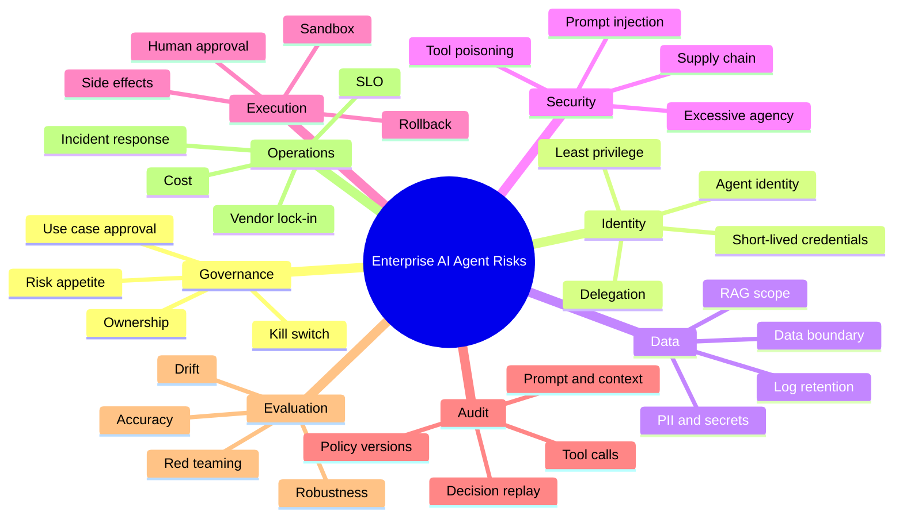

### 8.1 課題分類

| 大分類 | 根本課題 | 破綻しないための設計原則 |
|---|---|---|
| 経営・ガバナンス | どのリスクを誰が許容するかが曖昧 | AI利用方針、禁止用途、例外承認、停止権限、責任者を定義する |
| ユースケース責任分界 | モデル、ベンダー、業務部門、IT部門の責任が曖昧 | 意思決定者、実行承認者、監査責任者を業務プロセスに固定する |
| ID・権限 | エージェントが人間の代理で複数システムを横断する | 個別エージェントID、最小権限、短命トークン、権限棚卸しを行う |
| データ境界 | 入力、検索、出力、ログ、評価データの境界が曖昧 | データ分類、RAGスコープ、ログ保持、学習利用、越境移転を管理する |
| セキュリティ | 自然言語の命令とデータを完全に分離できない | プロンプトだけで守らず、ツール、権限、出力先、実行条件を制限する |
| ツール実行 | 判断ミスが業務アクションになる | 提案と実行を分離し、重要操作にはOPA判定とHITLを置く |
| 監査 | 後から「なぜ実行されたか」を再現できない | 入力、検索、プロンプト、モデル版、ポリシー版、tool call、承認、結果を紐づける |
| 評価・モデルリスク | 通常テストでは文脈依存の失敗を拾えない | 本番前評価、継続評価、回帰テスト、敵対的テストを行う |
| 信頼性・運用 | モデル、RAG、ツール、外部APIの複合障害になる | 分散システムとしてSLO、フォールバック、fail-closed、インシデント対応を設計する |
| コスト | ループ、再試行、長文コンテキストで予測不能になる | エージェント別、部門別、1処理あたりの単価と上限を管理する |
| 法務・規制 | AI法、個人情報、業法、知財、委託契約が重なる | 用途別に法務レビューし、データ処理と説明責任を記録する |
| ベンダーロックイン | モデルだけでなく評価、ログ、監査、ツール連携まで依存する | プロンプト、評価データ、ログスキーマ、権限設計、業務ルールを自社管理に寄せる |
| 変更管理・BCP | モデル、プロンプト、ポリシー、MCP Server、ツール定義が同時に変わる | バージョン昇格、ロールバック、DR/BCP、リリース承認、互換性テストを設計する |
| 委託先・利用者教育 | ベンダー運用、部門利用、現場の過信が統制外になる | 委託先監査、利用者教育、禁止行為、エスカレーション手順を整備する |

### 8.2 論理の骨格

AIエージェントのリスクは、次の因果関係で説明できる。

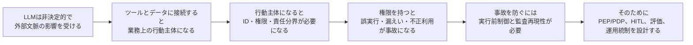

この論理から、以下の結論が導かれる。

1. LLMの出力品質だけでは導入可否を判断できない。
2. エージェントは「高機能チャット」ではなく「権限付き自動化」として扱う。
3. プロンプトやモデル安全性だけではなく、実行前の決定論的制御が必要である。
4. OPAなどのPDPは、LLMの外側に置く。
5. 監査ログは最終回答ではなく、入力、取得コンテキスト、tool call、policy decision、承認、実行結果の連鎖で残す。

## 9. 推奨リファレンスアーキテクチャ

以下は、Python製AIエージェントをエンタープライズ環境で動かす場合の推奨構成である。

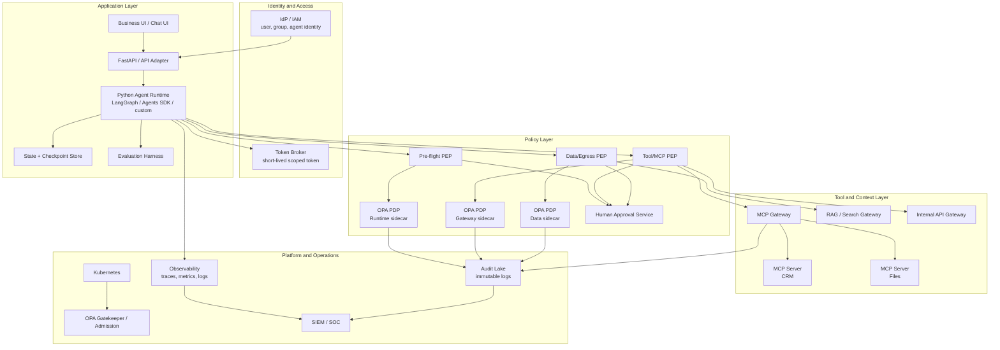

### 9.1 実装単位の推奨

| 実装単位 | 推奨 |
|---|---|
| Python Runtime | LangGraph、OpenAI Agents SDK、または独自Runtimeで、状態と承認待ちを明示的に扱う |
| Tool Gateway | すべてのtool callを通す唯一の経路にする。直接OS/API資格情報をLLM側へ渡さない |
| MCP Gateway | MCP Serverの発見、ツール一覧絞り込み、tools/call認可、監査を担う |
| OPA | Runtime/Gateway近傍にsidecar配置。ポリシーは中央RepoからBundle配布 |
| HITL | 承認ID、承認者、対象リソース、対象ハッシュ、期限を記録する |
| Audit | decision_id、run_id、tool_call_id、model_version、policy_bundle_versionを相関させる |
| Evaluation | 通常テスト、回帰テスト、プロンプトインジェクション、ツール誤実行、データ漏えいを継続評価する |

## 10. 導入ロードマップ

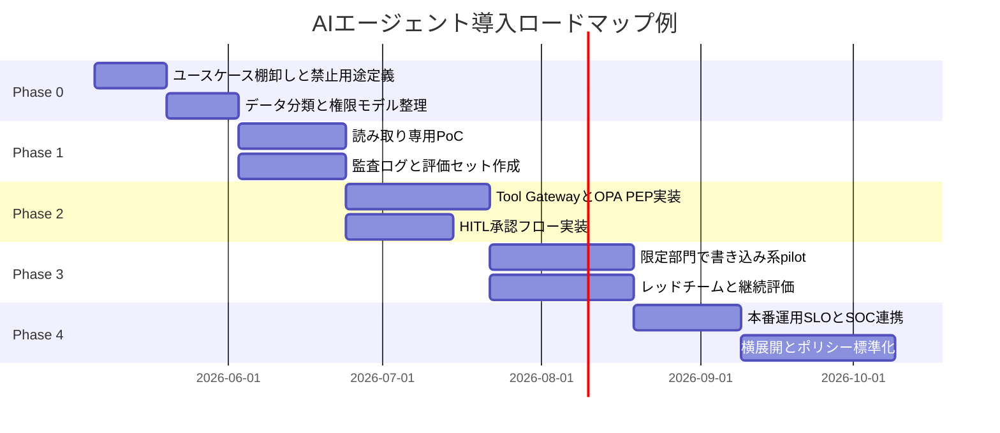

注: 日付は2026-05-06開始の例である。実案件ではPhase単位の相対期間として読み替える。

## 11. 導入可否チェックリスト

| チェック | Yesであるべき状態 |
|---|---|
| エージェントID | 人間共有IDではなく、用途別のエージェントIDを持つ |
| 権限 | 読み取り、書き込み、削除、外部送信、本番変更が分離されている |
| Pre-flight | 実行開始前にユーザー、用途、ツール、データ範囲を判定している |
| Tool PEP | すべてのtool callがGatewayを通り、OPAなどで同期判定される |
| MCP統制 | 承認済みMCP Serverのみ利用でき、shadow MCPを検出できる |
| HITL | 高リスク操作に承認、拒否、差し戻し、期限切れがある |
| 監査 | run_id、tool_call_id、decision_id、approval_id、model_versionを追跡できる |
| 評価 | 正常系だけでなく、攻撃、誤実行、過剰権限、漏えいを評価している |
| ログ境界 | 機密情報、PII、シークレットのログ保持とマスキング方針がある |
| 運用 | fail-closed、レート制限、コスト上限、停止手順、インシデント対応がある |
| 法務 | 個人情報、業法、知財、越境移転、委託先利用を確認済み |

## 12. 既存ワークスペース資料との関係

このワークスペースには、OPAでファイル操作を制御するAIエージェントアプリの資料が既にある。

- `/Users/nb-kimura/Desktop/test_python/docs/opa_ai_agent_app_spec.md`
- `/Users/nb-kimura/Desktop/test_python/opa-agent-app/docs/sequence.md`
- `/Users/nb-kimura/Desktop/test_python/opa-agent-app/docs/langgraph_agent_design.md`
- `/Users/nb-kimura/Desktop/test_python/opa-agent-app/examples/agent_components/component_loop_demo.py`

これらは、本資料のうち「Tool GatewayをPEPにし、OPAをPDPにして、AIエージェントに直接ファイルアクセスを渡さない」という設計の具体例である。特にファイル操作では、AIエージェントにOSファイルアクセスを直接渡さず、File Gatewayを唯一の実行者にする方針が妥当である。

`component_loop_demo.py`は依存ライブラリなしで動く最小サンプルであり、`PlannerLLM -> ToolCall -> PolicyEngine -> ToolGateway -> Observation -> VerifierLLM`の流れを確認できる。LangGraphを導入する前に、AIエージェントの構成をコードとして掴むための教材として使える。

## 13. 参考情報

公式・一次情報を中心に参照した。

- OpenAI Agents SDK: https://developers.openai.com/api/docs/guides/agents
- OpenAI Agents SDK Guardrails: https://openai.github.io/openai-agents-python/guardrails/
- OpenAI Agents SDK Tracing: https://github.com/openai/openai-agents-python/blob/main/docs/tracing.md
- LangGraph Workflows and Agents: https://docs.langchain.com/oss/python/langgraph/workflows-agents
- LangGraph Persistence: https://docs.langchain.com/oss/python/langgraph/persistence
- LangChain Tools: https://docs.langchain.com/oss/python/langchain/tools
- LangChain Human-in-the-loop: https://docs.langchain.com/oss/python/langchain/frontend/human-in-the-loop
- Model Context Protocol Architecture: https://modelcontextprotocol.io/specification/2025-11-25/architecture
- Model Context Protocol Authorization: https://modelcontextprotocol.io/specification/2025-11-25/basic/authorization
- MCP Tools: https://modelcontextprotocol.io/specification/2025-11-25/server/tools
- MCP Resources: https://modelcontextprotocol.io/specification/2025-11-25/server/resources
- MCP Prompts: https://modelcontextprotocol.io/specification/2025-11-25/server/prompts
- MCP 2025-11-25 Changelog: https://modelcontextprotocol.io/specification/2025-11-25/changelog
- Open Policy Agent docs: https://www.openpolicyagent.org/docs/latest
- OPA deployment patterns: https://www.openpolicyagent.org/docs/deploy
- OPA on Kubernetes: https://www.openpolicyagent.org/docs/deploy/k8s
- OPA REST API: https://www.openpolicyagent.org/docs/rest-api
- OPA Decision Logs: https://www.openpolicyagent.org/docs/management-decision-logs
- OPA Envoy Plugin: https://www.openpolicyagent.org/docs/envoy
- NIST AI Risk Management Framework: https://www.nist.gov/itl/ai-risk-management-framework
- NIST AI RMF Core: https://airc.nist.gov/airmf-resources/airmf/5-sec-core/
- NIST AI 600-1 Generative AI Profile: https://nvlpubs.nist.gov/nistpubs/ai/NIST.AI.600-1.pdf
- OWASP Top 10 for LLM Applications: https://owasp.org/www-project-top-10-for-large-language-model-applications/
- OWASP MCP Top 10: https://owasp.org/www-project-mcp-top-10/
- UK NCSC Prompt injection is not SQL injection: https://www.ncsc.gov.uk/blog-post/prompt-injection-is-not-sql-injection
- CISA Roadmap for AI: https://www.cisa.gov/resources-tools/resources/roadmap-ai
- ISO/IEC 42001:2023: https://www.iso.org/standard/42001
